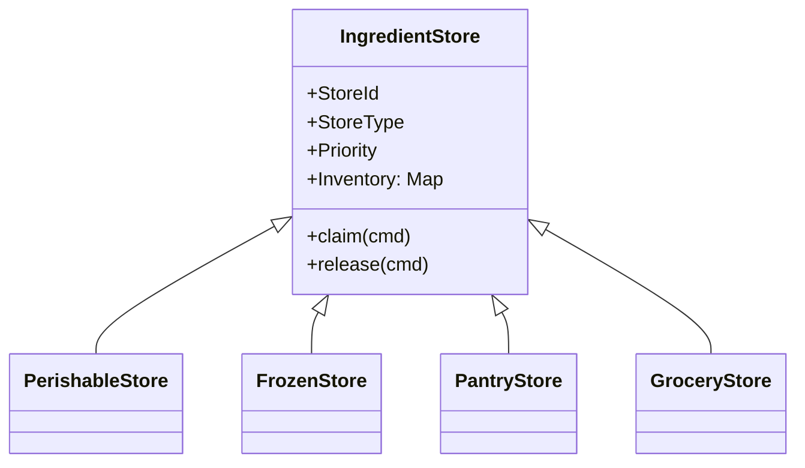

# Meal Planning Application – Domain Architecture (DDD)

## 1. Vision & Core Problem

A family‑oriented meal‑planning assistant that optimises **ingredient utilisation** across mixed inventories (CSA produce, freezer stock, pantry staples & grocery purchases) while supporting iterative, AI‑driven recipe planning. It must react in real‑time to inventory changes and user feedback, maintaining an immutable but lightweight stream of domain events that keeps the UI and core logic nicely decoupled.

---

## Design Philosophy – Minimal Schema with LLM Assistance

We lean on a **LLM reasoning engine** for many validation and transformation tasks.\
Therefore:

- **Keep schemas lean.**  Only fields that must remain consistent across contexts (e.g., `recipeId`, units, timestamps) are strictly typed.
- **Flexible narrative blobs.**  Rich instructions, user prompts and AI‑generated suggestions live in free‑text fields, embeddings or JSON fragments—whatever is easiest to evolve.
- **Immutable events > complex state.**  We log minimal events for decoupling and replay, not for exhaustive compliance records.

---

## 2. Bounded Contexts & High‑Level Components

| Context                       | Business Purpose                                                 | Core Modules                                       |
| ----------------------------- | ---------------------------------------------------------------- | -------------------------------------------------- |
| **Ingredient**                | Canonical ingredient representation, normalization & unit conversion. | *Ingredient*, *IngredientNormalizer*, *UnitConverter*, *IngredientMatcher* |
| **Recipe**                    | Recipe storage, lifecycle management and materialization.        | *Recipe*, *RecipeCatalog*, *RecipeMaterializer*    |
| **Inventory**                 | Track what ingredients exist, where they live and how they flow. | *IngredientStore*, *IngredientBroker*, Event Store |
| **Planning**                  | Generate, negotiate and evolve meal plans.                       | *RecipePlanner*, *MealPlan*, *Claim Saga*          |
| **Execution**                 | Support cooking day-of (instructions, timers) & decrement stock. | *CookSession*, *InventoryAdjuster*                 |
| **User Interface** (external) | Surfaces real‑time progress & captures intent.                   | Desktop Electron UI (Svelte), WebSocket client     |

*Communication across contexts occurs exclusively through ****Domain Events****; each context owns its own data schema and translation layers.*

---

## 3. Ubiquitous Language Glossary

- **Ingredient** – canonical representation of a food item with normalized name and default unit.
- **IngredientRequirement** – normalized ingredient specification for meal planning (ingredient + quantity + unit).
- **IngredientStore** – a *root aggregate* representing a physical or virtual source of ingredients.
- **Claim** – an immutable reservation of specific ingredient quantities for a proposed recipe.
- **Broker** – the domain service mediating between multiple stores and planners.
- **Recipe Materialization** – process of converting stored recipe into normalized IngredientRequirements.
- **Proposal** – a recipe idea in `Pitch` form awaiting confirmation.
- **MealPlan** – a weekly collection of meals in various readiness states.
- **Event** – a fact that something domain‑significant *happened* (e.g., `IngredientClaimed`).

---

## 4. IngredientStore Hierarchy

### 4.1 Aggregate Root & Sub‑Entities



- **Invariant** – Quantity of any lot can never fall below zero.

### 4.2 Value Objects

| VO           | Fields                                          | Purpose                                |
| ------------ | ----------------------------------------------- | -------------------------------------- |
| **Lot**      | `ingredientId`, `qty`, `bestBefore?`, `batchId` | Fine‑grained tracking & FIFO depletion |
| **Quantity** | `amount`, `unit`                                | Enforces unit consistency & arithmetic |

### 4.3 Domain Events (Inventory Context)

- `IngredientAddedToStore`
- `IngredientRemovedFromStore`
- `IngredientClaimed`
- `IngredientClaimReleased`

*Stores apply commands → record events → rebuild current state from event stream.*

---

## 5. IngredientBroker – Negotiation Pattern

### 5.1 Role

A **Domain Service** that delivers a unified availability view and arbitrates claims.

### 5.2 Interaction Sequence (Command/Result)

1. **RecipePlanner** issues `ProposeClaim(cmd)` containing required `IngredientSet`.
2. **Broker** checks each `IngredientStore` by priority:
   - Accepts from highest‑priority store able to fulfil qty.
   - If deficit, emits `InsufficientQuantity(event)` per item.
3. Broker returns `ClaimResult`:
   - `Accepted(claimId)` – all quantities reserved.
   - `Partial(insufficient[])` – Planner may substitute or adjust.
   - `Rejected(reason)`.
4. Any accepted claim is persisted via `IngredientClaimed` events in each affected store.

### 5.3 Saga – **Claim Lifecycle**

A short‑lived saga orchestrates *commit‑or‑rollback* semantics:

- **Pending** → **Committed** (`MealPlanFinalised`)
- **Pending** → **Released** (`PlanDiscarded`)

Saga listens to both Planning & Inventory events to maintain consistency.

---

## 5.4 IngredientClaim vs Recipe Ingredient List

*A concise reference*

## 5.5 Recipe Aggregate – Lifecycle & Views

The **Recipe** is its own aggregate inside the **Planning** context. It progresses from a *lightweight pitch* to a *fully‑detailed, role‑specific* recipe while preserving history.

### 5.5.1 MVP Structure (Walkway)

| Element             | Type                                      | Purpose                                |
| ------------------- | ----------------------------------------- | -------------------------------------- |
| `recipeId`          | Identifier (UUID)                         | Aggregate key                          |
| `status`            | Enum ⟨Pitch \| Draft \| Final⟩            | Governs allowed commands               |
| `title`             | String                                    | Human‑readable handle                  |
| `servings`          | Integer                                   | Scaling basis                          |
| `ingredientSpecs[]` | Value Object: `{name, qty, unit, notes?}` | Static requirements (no store binding) |
| `steps[]`           | Ordered String[]                          | Simple instructions                    |
| `meta`              | Map                                       | Tags, cuisine, dietary flags           |

**Commands**: `CreatePitch`, `RefineToDraft`, `AddStep`, `UpdateIngredientSpec`, `PublishFinal`\
**Invariant**: quantities > 0; cannot regress `status`.

### 5.5.2 Evolving Feature Set (Runway)

| Future Need                | Extension                                                                             |
| -------------------------- | ------------------------------------------------------------------------------------- |
| **Versioning & branching** | `RecipeRevision` child entities; event `RecipeForked`                                 |
| **Role‑based workflows**   | `Step` VO upgraded to `{text, role, duration, equipment?}` enabling *Sous Chef* views |
| **Parallel timing**        | DAG of step dependencies for Gantt‑style schedule                                     |
| **Nutrition & cost**       | Projection consumes `ingredientSpecs` & external facts                                |
| **Portion scaling**        | `Quantity` VO gains `scale(servings)` method                                          |

### 5.5.3 Domain Events

- `RecipePitched` (status = Pitch)
- `RecipeDetailed` (→ Draft)
- `RecipeFinalised` (→ Final)
- `StepTagged`
- `RecipeViewGenerated` (projection trigger)

### 5.5.4 Read‑Model Projections

| View                     | Filter Logic                                       |
| ------------------------ | -------------------------------------------------- |
| **SousChefPrepView**     | `steps.role == sous_chef` across upcoming meals    |
| **ShoppingListView**     | Sum `ingredientSpecs` minus `CurrentInventoryView` |
| **DayOfCookingTimeline** | Topologically sorted steps with durations          |

### 5.5.5 Recipe Materialization Process

When a recipe is selected for meal planning, it undergoes **materialization** - converting original ingredient specifications into normalized `IngredientRequirement` objects:

1. **Recipe Context** provides original ingredient specifications (e.g., "2 lbs carrots", "1 can tomatoes")
2. **Ingredient Context** normalizes each specification:
   - Creates canonical `Ingredient` entities ("carrots", "canned tomatoes")
   - Converts quantities to standard units (2.0 lbs, 14.5 oz)
   - Preserves original specification for user reference
3. **Planning Context** receives `IngredientRequirement[]` for broker negotiation

```python
@dataclass
class IngredientRequirement:
    ingredient: Ingredient      # Normalized ingredient entity
    quantity: float            # Converted to standard units
    unit: str                  # Canonical unit
    original_spec: str         # "2 lbs carrots" - preserved for reference
```

### 5.5.6 Interaction with Planner & Broker

The **RecipePlanner** issues the lifecycle commands. When a recipe is materialized for meal planning, the **RecipeMaterializer** converts `ingredientSpecs` into normalized `IngredientRequirement` objects via the **Ingredient Context**. These requirements are then handed to the **IngredientBroker** for availability negotiation and claim creation.

> **Why materialize lazily?** This preserves recipe authenticity while enabling context-aware normalization with current inventory knowledge, and allows normalization improvements without recipe data migration.

A **Recipe Ingredient List** is a *static description* of what a dish requires (e.g., "200 g carrots", "1 can coconut milk"). It lives inside the `Recipe` aggregate and remains unchanged across planning sessions.

An **IngredientClaim** is an *ephemeral reservation* that binds a particular meal instance (not the recipe template) to **specific lots** inside one or more `IngredientStore`s. The claim answers the questions *“Which batch of carrots?”* and *“From which store?”* while maintaining the invariant that two future meals cannot double‑book the same carrot.

This distinction matters when:

- You plan meals that span **multiple shopping cycles** (e.g., before and after a grocery trip). A claim lets you partition inventory so the first half of the week cannot steal ingredients earmarked for the second half.
- You introduce **parallel planners** or “mini‑brokers.” Each broker can be parameterised with a `StoreFilter` (e.g., `scope: "pre‑grocery"`) so they reserve from disjoint subsets of stores while the underlying event store still enforces global consistency.
- You need **easy replay and debugging**. Because every claim is an event‑sourced entity, you can replay and debug why an item went missing.

If you are certain you will always have a single user and a single planning window you *could* collapse the concept. We keep it separate because the cost (one small aggregate and a handful of events) is low compared with the flexibility and correctness guarantees it provides.

## 6. RecipePlanner – State Machine

```plantuml
state "Recipe Planner" as RP {
    [*] --> Idle
    Idle --> Pitching : receive MealPlanSpec
    Pitching --> Negotiating : sent Proposal
    Negotiating --> Adapting : Claim Partial
    Adapting --> Negotiating : new Proposal
    Negotiating --> Confirmed : Claim Accepted
    Confirmed --> GeneratingFull : user approves
    GeneratingFull --> Delivered : full recipe ready
    Delivered --> Idle : meal plan complete
    Adapting --> Abandoned : retries > N
}
```

### Key Actions

| State              | Behaviour                                                          |
| ------------------ | ------------------------------------------------------------------ |
| **Pitching**       | Generate high‑level concepts prioritising perishable inventory     |
| **Negotiating**    | Submit ingredient sets to Broker, await result                     |
| **Adapting**       | Substitute, split or discard ingredients; may alter recipe lineage |
| **GeneratingFull** | Expand pitch into detailed recipe; refresh claims                  |

State transitions are emitted as **Planning Events** (`RecipeProposed`, `ClaimAccepted`, `RecipeFinalised`, etc.)

---

## 7. Event Sourcing & Persistence Model

### 7.1 Streams

| Stream                      | Partition Key          | Sample Events                               |
| --------------------------- | ---------------------- | ------------------------------------------- |
| `IngredientStore-{storeId}` | Store                  | Added, Removed, Claimed, Released           |
| `MealPlan-{planId}`         | Planning session       | ProposalCreated, ClaimResults, UserFeedback |
| `Recipe-{recipeId}`         | Recipe version history | StateTransition, RatingAdded                |

- **Snapshots** every *N* events per stream for fast rebuilds.
- **Projections** materialise query models (e.g., *CurrentInventoryView*, *ShoppingList*).

### 7.2 Outbox Pattern

Every domain event written adds an *Outbox* record → publisher relay → **Event Bus** (e.g., NATS, local in‑process EventEmitter).

---

## 8. Real‑Time Update Mechanisms

1. **Event Bus → WebSocket Hub** – Infrastructure subscriber translates domain events into UI messages.
2. Clients subscribe by `planId` & `storeId` to receive minimal JSON payloads.
3. Optimistic UI: client may speculatively update on command and reconcile on ack.
4. Heart‑beat & reconnect logic maintain session integrity.

---

## 9. Technical Layering

| Layer              | Contents                                                     | Notes                                     |
| ------------------ | ------------------------------------------------------------ | ----------------------------------------- |
| **Domain**         | Entities, Value Objects, Aggregates, Domain Services, Events | Pure business logic, no framework types   |
| **Application**    | Command handlers, Sagas, Orchestrators, Projections          | Transactions & security boundaries        |
| **Infrastructure** | EventStore DB, Outbox, Message Bus, WebSocket server         | Swappable adapters                        |
| **Interface**      | REST/GraphQL APIs, WebSocket endpoints, Svelte UI            | Only consumes projections, never entities |

---

## 10. End‑to‑End Example Flow (Happy Path)

1. **User** submits `WeekPlanSpec`.
2. **Planner** enters *Pitching* → emits `RecipeProposed` (`Pitch‑state`).
3. **Broker** reserves perishable items → emits `IngredientClaimed`.
4. UI receives `RecipeProposed` & `IngredientClaimed` → live list updates.
5. User approves recipe → Planner generates full recipe → events cascade.
6. **MealPlanFinalised** → Saga commits all claims → `InventoryAdjusted` projection updates grocery list.

---

## 11. Extensibility & Testing Strategy

- **Module contracts** versioned; breaking changes gated through anti‑corruption layers.
- Property‑based tests for negotiation algorithm (Broker).
- In‑memory EventStore for fast unit tests; integration tests run against containerised infra.
- Replay‑driven debugging: reproduce any planning session from its event log.

---

> *This architecture refines and formalises the earlier design draft, adding strict DDD boundaries, event‑sourced persistence and a reactive UI pipeline ready for production scale.*
